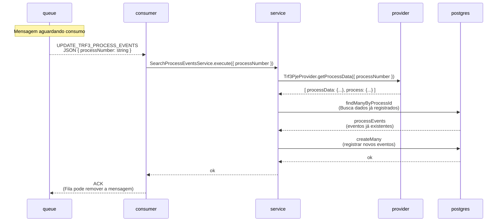
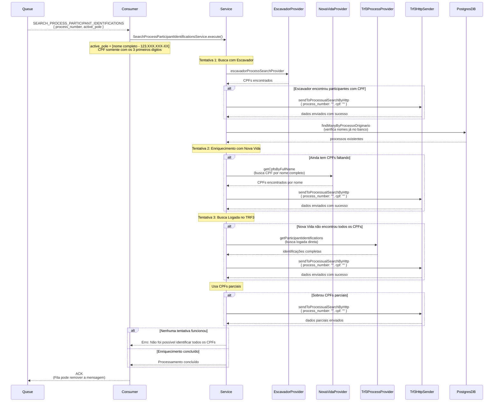

# TRF3 Events

A aplicação TRF3 Events é um sistema automatizado de busca e processamento de eventos de processos do Tribunal Regional Federal da 3ª Região, que extrai dados processuais, documenta eventos e realiza identificação de participantes com enriquecimento de CPF através de múltiplos providers.

## **Pré-requisitos**

- Node.js versão 20.x
## Setup

1. **Criar arquivo .npmrc**
> [Gere o token em Settings → Developer settings → Personal access tokens → Tokens (classic)](https://github.com/settings/tokens)
   >
   > Substitua o token gerado em TOKEN

```bash
@precato:registry=https://npm.pkg.github.com/
@precatoorg:registry=https://npm.pkg.github.com/
//npm.pkg.github.com/:_authToken=TOKEN
```

2. **Instalar dependências**

   ```bash
   npm install
   ```

3. **Criar arquivo .env**

> Copie as variáveis de ambiente do arquivo _.env.example_

4. **Iniciar containers necessários**

   - Ligar container do _rabbit_
   - Ligar container do _mongo_
   - Ligar container do _postgres_
   - Ligar container do redis
   - Ligar a aplicação do _database-server_ (verificar se foi rodado todas as migrations)

5. **Executar aplicação**
   ```bash
   npm run dev
   ```
## Fluxos da Aplicação

### 1. Busca de Eventos por Arquivo

1. **Recebe** arquivo XLSX via HTTP POST com números de processos
2. **Processa** arquivo e extrai números dos processos
3. **Envia** cada processo para fila RabbitMQ `UPDATE_TRF3_PROCESS_EVENTS`
4. **Consumer** processa mensagens da fila
5. **Busca** dados do processo no TRF3 via web scraping
6. **Extrai** eventos e documentos do processo
7. **Salva** dados no PostgreSQL
8. **Verifica** palavras-chave (ex: "precatório") nos eventos
9. **Envia** para fila de identificação de participantes se encontrar palavras-chave
10. **Trata erros** enviando para fila de erro com retry para captcha inválido

### 2. Identificação de Participantes

1. **Recebe** requisição HTTP POST ou processa da fila de eventos
2. **Envia** dados para fila RabbitMQ `TRF3_SEARCH_PARTICIPANT_IDENTIFICATIONS`
3. **Consumer** processa com múltiplas estratégias de busca:
    - **1ª Tentativa**: Busca via Escavador Provider
    - **2ª Tentativa**: Enriquecimento via Nova Vida Provider (busca CPF por nome)
    - **3ª Tentativa**: Busca logada direta no TRF3 (fallback final)
4. **Controla** limite de buscas (por minuto e diário)
5. **Envia** CPFs encontrados para sistema de busca processual
6. **Trata erros** coletando em arquivos CSV para análise

## Endpoints

### `/trf3/add-by-file`

- **Método**: POST (Multipart)
- **Descrição**: Upload de arquivo XLSX com números de processos para busca de eventos
- **Formato**: Arquivo Excel com coluna "PROCESSO"
- **Retorno**: Status 200 (processamento assíncrono)

### `/participant-identifications`

- **Método**: POST
- **Descrição**: Adiciona processo na fila de identificação de participantes
- **Formato**: JSON

```json
{
  "process_number": "string",
  "active_pole": ["string"]
}
```

### `/health`

- **Método**: GET
- **Descrição**: Verificação de saúde da aplicação
- **Retorno**: `{"status": "ok"}`
### Fluxo: Busca de Eventos de Processos 


### Fluxo: Identificação de Participantes de Processo


