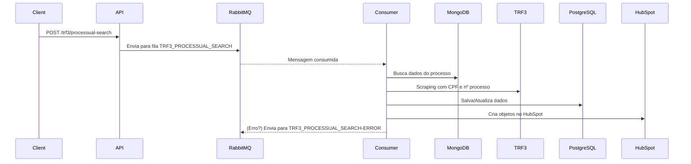
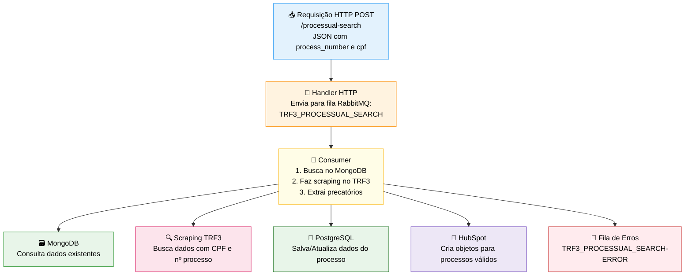

# TRF3

A aplicação TRF3 é um sistema automatizado de web scraping que busca, extrai e processa dados de precatórios e RPVs do Tribunal Regional Federal da 3ª Região, integrando com sistemas externos como HubSpot para gestão de leads jurídicos.

## Setup

1. **Criar arquivo .npmrc**
   > [Gere o token em Settings → Developer settings → Personal access tokens → Tokens (classic)](https://github.com/settings/tokens)
   >
   > Substitua o token gerado em TOKEN

```bash
@precato:registry=https://npm.pkg.github.com/
//npm.pkg.github.com/:_authToken=TOKEN
```

2. **Instalar dependências**

   ```bash
   npm install
   ```

3. **Criar arquivo .env**

   > Copie as variáveis de ambiente do arquivo _.env.example_

4. **Iniciar containers necessários**

   - Ligar container do _rabbit_
   - Ligar container do _mongo_
   - Ligar container do _postgres_
   - Ligar a aplicação do _database-server_

5. **Executar aplicação**
   ```bash
   npm run dev
   ```

## Fluxo da Aplicação

1. **Recebe** requisição HTTP POST com `process_number` e `cpf`
2. **Envia** dados para fila RabbitMQ `TRF3_PROCESSUAL_SEARCH`
3. **Consumer** processa mensagem da fila
4. **Busca** dados do processo no MongoDB
5. **Faz scraping** no site do TRF3
6. **Resolve captchas** automaticamente
7. **Extrai** informações dos precatórios
8. **Salva** dados no PostgreSQL
9. **Cria** objetos no HubSpot
10. **Trata erros** enviando para fila de erro

### Entrada

A aplicação recebe requisições HTTP POST com:

- **Formato**: JSON contendo `process_number` e `cpf`

```json
{
  "process_number": "string",
  "cpf": "string"
}
```

- **Endpoint**: `/trf3/processual-search`

### Processamento

1. **Handler HTTP** recebe a requisição e envia para fila RabbitMQ (`TRF3_PROCESSUAL_SEARCH`)
2. **Consumer** processa a mensagem da fila executando:
   - Busca dados do processo no MongoDB
   - Faz scraping no site do TRF3 usando CPF e número do processo
   - Extrai informações dos precatórios encontrados

### Saída

- **Banco de dados**: Salva/atualiza dados no PostgreSQL
- **HubSpot**: Cria objetos no HubSpot para processos válidos
- **Fila de erro**: Em caso de falha, envia para fila `TRF3_PROCESSUAL_SEARCH-ERROR`




