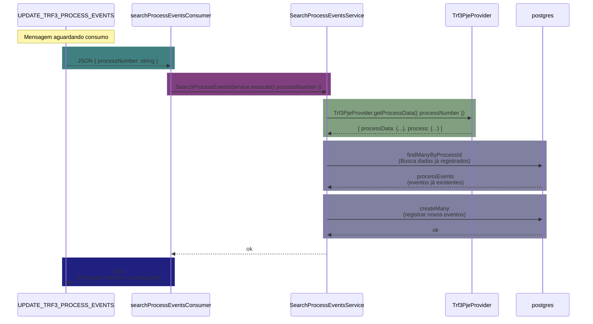
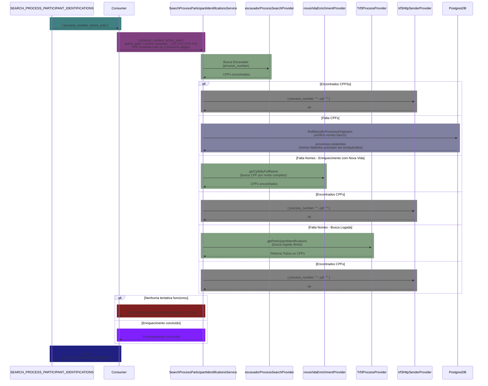

# TRF3 Events

A aplicação TRF3 Events é um sistema automatizado de busca e processamento de eventos de processos do Tribunal Regional Federal da 3ª Região, que extrai dados processuais, documenta eventos e realiza identificação de participantes com enriquecimento de CPF através de múltiplos providers.

## **Pré-requisitos**

- Node.js versão 20.x

## Setup

1. **Criar arquivo .npmrc**
   > [Gere o token em Settings → Developer settings → Personal access tokens → Tokens (classic)](https://github.com/settings/tokens)
   >
   > Substitua o token gerado em TOKEN

```bash
@precato:registry=https://npm.pkg.github.com/
@precatoorg:registry=https://npm.pkg.github.com/
//npm.pkg.github.com/:_authToken=TOKEN
```

2. **Instalar dependências**

   ```bash
   npm install
   ```

3. **Criar arquivo .env**

> Copie as variáveis de ambiente do arquivo _.env.example_

4. **Iniciar containers necessários**
   - Ligar container do _rabbit_
   - Ligar a aplicação do _database-server_

5. **Executar aplicação**
   ```bash
   npm run dev
   ```



### Fluxo: Identificação de Participantes de Processo


