# TRF3

A aplicação TRF3 é um sistema automatizado de web scraping que busca, extrai e processa dados de precatórios e RPVs do Tribunal Regional Federal da 3ª Região, integrando com sistemas externos como HubSpot para gestão de leads jurídicos.

## Setup

1. **Criar arquivo .npmrc**
   > [Gere o token em Settings → Developer settings → Personal access tokens → Tokens (classic)](https://github.com/settings/tokens)
   >
   > Substitua o token gerado em TOKEN

```bash
@precato:registry=https://npm.pkg.github.com/
//npm.pkg.github.com/:_authToken=TOKEN
```

2. **Instalar dependências**

   ```bash
   npm install
   ```

3. **Criar arquivo .env**

   > Copie as variáveis de ambiente do arquivo _.env.example_

4. **Iniciar containers necessários**

   - Ligar container do _rabbit_
   - Ligar container do _mongo_
   - Ligar container do _postgres_
   - Ligar a aplicação do _database-server_

5. **Executar aplicação**
   ```bash
   npm run dev
   ```

## Fluxo da Aplicação

1. **Recebe** requisição HTTP POST com `process_number` e `cpf`
2. **Envia** dados para fila RabbitMQ `TRF3_PROCESSUAL_SEARCH`
3. **Consumer** processa mensagem da fila
4. **Busca** dados do processo no MongoDB
5. **Faz scraping** no site do TRF3
6. **Resolve captchas** automaticamente
7. **Extrai** informações dos precatórios
8. **Salva** dados no PostgreSQL
9. **Cria** objetos no HubSpot
10. **Trata erros** enviando para fila de erro

### Entrada

A aplicação recebe requisições HTTP POST com:

- **Formato**: JSON contendo `process_number` e `cpf`

```json
{
  "process_number": "string",
  "cpf": "string"
}
```

- **Endpoint**: `/trf3/processual-search`

### Processamento

1. **Handler HTTP** recebe a requisição e envia para fila RabbitMQ (`TRF3_PROCESSUAL_SEARCH`)
2. **Consumer** processa a mensagem da fila executando:
   - Busca dados do processo no MongoDB
   - Faz scraping no site do TRF3 usando CPF e número do processo
   - Extrai informações dos precatórios encontrados

### Saída

- **Banco de dados**: Salva/atualiza dados no PostgreSQL
- **HubSpot**: Cria objetos no HubSpot para processos válidos
- **Fila de erro**: Em caso de falha, envia para fila `TRF3_PROCESSUAL_SEARCH-ERROR`

```mermaid
flowchart TD
    style Entrada fill:#e3f2fd,stroke:#2196f3,color:#000
    style Handler fill:#fff3e0,stroke:#fb8c00,color:#000
    style Consumer fill:#fffde7,stroke:#fbc02d,color:#000
    style Mongo fill:#e8f5e9,stroke:#43a047,color:#000
    style Scraping fill:#fce4ec,stroke:#d81b60,color:#000
    style PostgreSQL fill:#e8f5e9,stroke:#2e7d32,color:#000
    style HubSpot fill:#ede7f6,stroke:#673ab7,color:#000
    style FilaErro fill:#ffebee,stroke:#c62828,color:#000

    Entrada["📥 Requisição HTTP POST\n/processual-search\nJSON com process_number e cpf"]

    Handler["🧩 Handler HTTP\nEnvia para fila RabbitMQ:\nTRF3_PROCESSUAL_SEARCH"]

    Consumer["🎯 Consumer\n1. Busca no MongoDB\n2. Faz scraping no TRF3\n3. Extrai precatórios"]

    Mongo["🗃️ MongoDB\nConsulta dados existentes"]

    Scraping["🔍 Scraping TRF3\nBusca dados com CPF e nº processo"]

    PostgreSQL["💾 PostgreSQL\nSalva/Atualiza dados do processo"]

    HubSpot["🧩 HubSpot\nCria objetos para processos válidos"]

    FilaErro["🚨 Fila de Erros\nTRF3_PROCESSUAL_SEARCH-ERROR"]

    Entrada --> Handler
    Handler --> Consumer
    Consumer --> Mongo
    Consumer --> Scraping
    Consumer --> PostgreSQL
    Consumer --> HubSpot
    Consumer --> FilaErro

```



